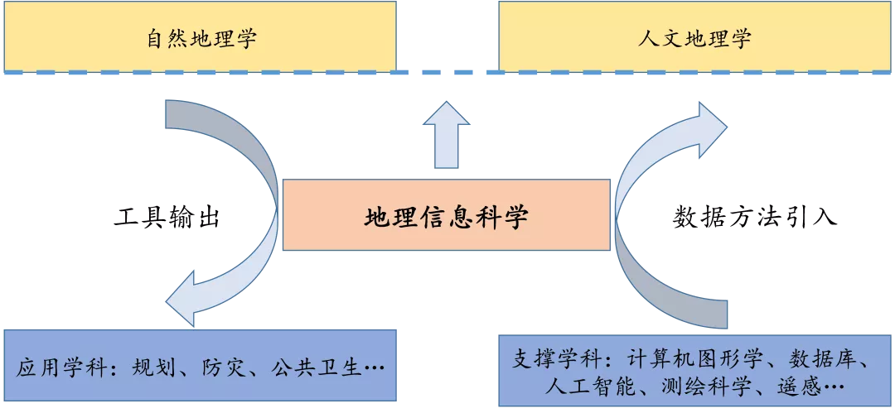
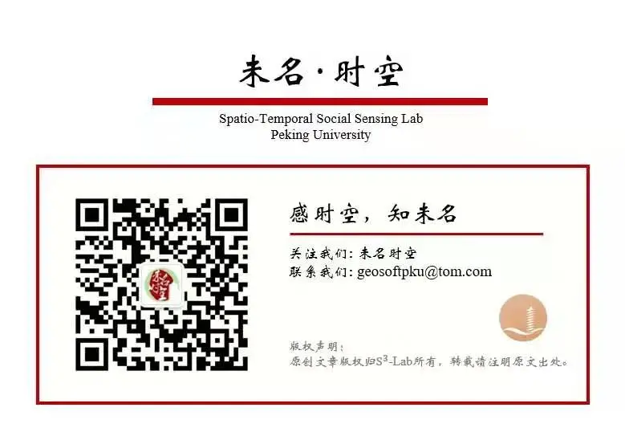

## 导读
地理信息科学作为具有外缘特征的交叉学科，传承了地理学的空间分析传统，将其他学科的方法与地理空间特性相结合，并探讨地理规律在普遍性和特殊性之间的平衡。同时，它处在地理学学科体系中核心地位，从“夯实理论基础”以及“提升技术并推动应用”两方面使地理学更强大。

## 1 地理信息科学
 地理信息科学（Geographical Information Science，GIScience）是信息地理学的重要分支之一。在技术和工具层面，地理信息系统（Geographical Information System，GIS）是地理信息科学研究成果的具体实现，它在信息技术支持下，对地理空间数据进行采集、管理、分析、表达。地理信息系统遵循数据、信息、知识、智慧的递进层次体系，构建了地理空间模拟、预测、优化等一系列方法。这些方法有助于研究揭示地理现象和要素的分布形态、相互作用、动态演化和驱动机理，从而服务于空间决策支持（李新等，2021）。地理信息系统的出现和发展，一方面得益于信息技术的发展和支持，另外，计量革命也为它提供了丰富的方法源泉（Johnston和Taylor，1995）。地理信息系统自诞生之日，就在工具层面支持地理学研究及其应用。与此同时，人们也认识到需要探讨地理信息创建、处理、存储和使用中的科学问题。为此，Goodchild（1992）提出了地理信息科学的概念。它致力解决地理信息系统实现和应用中的基础科学问题，如美国国家地理信息与分析中心提出的三大研究主题包括：地理空间的认知模型、地理概念表达的计算方法和信息社会的地理学（Goodchild等，1999）。概括而言，地理信息科学在信息系统的语境下，研究地理学基本概念和规律的抽象和形式化表达，从而为地理信息系统的实现和应用奠定理论基础（Mark，2004）。

## 2 地理信息科学在地理学中的学科地位
目前，地理信息科学已经和自然地理学、人文地理学一起，成为地理学三大二级学科之一。在学科体系中，地理信息科学具有独特的、不可或缺的地位，主要体现在以下三个方面（图1）：1）它为部门地理学研究提供数据整合和分析的方法和工具，从而强调地理学作为观测性学科的性质（牛书丽等，2020）；2）为了达成上述目标，需要研究地理学基础概念和规律的形式化，通过体现“空间思维（spatial thinking）”，强化地理学作为一个统一学科的理论基础；3）借助于信息系统的开发，将地理学研究成果输出到其它领域，产生知识溢出，体现了地理学“经世致用”的特点。

回顾地理学四大传统，即空间分析传统、区域研究传统、人地关系传统和地球科学传统（Pattison，1964），地理信息科学研究更多传承了空间分析传统，即关注地理现象的空间配置和相互作用的分布模式，模式背后的一般性规律，以及规律的空间可泛化性。由于“空间是特殊的（spatial is special）”（Longley等，2014），使得地理信息科学之所以成为一个重要的研究方向。在地理空间的特性中，异质性是地理学存在的学科基础（傅伯杰，2017）。由于空间异质性的存在，导致了地理学研究的两个视角（Longley等，2014）：其一可以称为“关注特殊性的地理（idiographic geography）”，它关注地理现象的形态描述，强调不同地理单元的独特性；其二为“关注普遍性的地理（nomothetic geography）”，它更强调普遍性的规律和法则。在研究中，通常是将一般性的地理规律和法则应用于一个具体地区，和当地具体情况相结合，从而得到关于该地区的新的知识。例如，可以将一个区域分析得到的坡度、岩性、植被覆盖等要素和滑坡风险之间的定量关系，迁移到滑坡机理相似的另一区域，并对该区域的滑坡风险进行评估和制图。地理信息系统的实现，兼顾了特殊性和普遍性。一方面，它通过空间数据表达不同地区的地理现象和地理要素特征，从而体现空间异质性，并构建了一系列处理空间局域异质性以及空间分层异质性的方法（Wang等，2016）；另一方面，它采用同样的分析方法，来处理不同区域的数据，这展示了地理学规律的普遍性。值得指出的是，很多空间分析方法，如地理加权回归（Fotheringham等，2002），也体现了地理学研究在特殊性和普遍性之间的折衷（Goodchild，2004）。

计算机软件是对客观世界中知识的提炼和“固化”（杨芙清和梅宏，2008），这里所说的“固化”即为形式化。从软件系统的角度看，地理信息科学在对地理空间、地理现象和地理要素进行建模的基础上，通过数据模型和算法，形式化地理学的基本概念和基本规律。在数据模型方面，对象和场这两个基本概念模型表达了地理现象的空间分布及不同地理要素的特征，不论是自然地理抑或是人文地理的研究对象，都呈现为一致的形式。在空间分析方法上，则体现了地理研究所关注的基本规律。例如，Tobler地理学第一定律（Tobler，1970）表达了距离对于地理分布格局的影响，蕴含了两个方面的含义（Miller，2004）：首先是地理分布的相似性（或空间依赖），即空间上越近的位置属性越相似；其次是空间交互的强度，该强度可采用人口、物资、信息等在空间中的流动来度量，距离越近的两个地理单元，相似度越高，空间交互也相对越强。地理信息系统则提供了相应分析方法以“固化”第一定律所蕴含的思想，如空间插值和空间自相关度量等体现前者，而重力模型等则用于量化空间交互。毋庸置疑，上述方法同时适用于自然地理学和人文地理学研究。因此，地理信息科学研究更为一般的概念和规律表达，如空间异质性与空间依赖、尺度和距离衰减，其成果可指导相关学科更好地进行地理空间分析，从而对地理学科的整体发展起到了不可替代的作用。正如陈述彭院士生前经常强调的，地理信息科学有助于将地理学的不同分支综合起来。因此，毋庸置疑，地理信息科学在地理学学科体系中处于“核心”位置。

## **3 作为交叉学科的地理信息科学**

地理信息科学是多种学科交叉的产物，它扮演了地理学与其它学科之间联系桥梁的角色。这种联系主要体现在数据和方法两个层面。

   在数据上，地理信息科学研究不同地理空间数据的生产、传输、表达机理，构建数据质量和不确定性评估模型，解决地理学研究中数据使用的问题。因此，它和测绘科学等学科存在着密切的联系，后者通过研究地理空间数据的精确获取技术，解决地理信息科学的数据源问题。其中遥感、全球卫星导航系统等技术的迅猛发展，极大丰富了地理信息科学分析和研究的数据类型（如全球土地覆被数据、城市和建筑三维数据、个体粒度的轨迹数据等等）。目前，地理研究已经进入到大数据时代。大数据不仅包含了人类大量地理知识的长期累积，同时也是新的技术手段支持下大范围地理现象和要素（包括个体粒度的人）的高分辨率感知能力的体现（Liu等，2015；裴韬等，2019）。地理大数据和传统数据相结合，大大拓展了地理信息应用的深度和广度。

   在方法上，地理信息科学也得益于信息科学与技术的快速发展。毋庸置疑，后者已经改变了，并且必将更为深刻地改变几乎所有学科的面貌。例如，人工智能已经可以帮助科学家自动发现科学规律，提取科学知识（Granda等，2018；Iten等，2020）。对于地理学而言，这一影响趋势也不例外（郭庆华等，2020）。纵观历史，从单机到互联网，再到移动互联网，地理信息应用的形态在不断演化。如今，信息科学与技术的发展等为地理信息系统带来了新的机遇，同时为地理信息科学提供了新的研究议题。高性能计算提供了强大的分析模拟能力，人工智能则提升了对复杂时空模式的理解能力（Reichstein等，2019；Janowicz 等，2020），这些技术手段的进步，有力支持地理学规律发现、地理演化过程预测、以及地理空间决策优化，从而使地理学突破计量革命时代遇到的困境。值得指出的是，从知识外溢的角度，地理信息科学研究也丰富了信息科学领域的方法体系，并服务于相邻学科的应用研究。

   因此，作为处在“外缘”位置的交叉学科，地理信息科学通过引进其它学科的新数据和新方法，并与地理空间的特殊性相结合，支持地理研究的创新发展，从而使得整个学科保持生机和活力。

## **4 总结与展望**

信息时代的到来使得地理学研究对象从自然、人文要素扩展到了信息要素（闾国年等，2021），面向未来，地理信息科学作为地理学和信息技术结合最为紧密的方向，一方面要注重信息技术在向地理学迁移过程中的“本地化”，另一方面，也要促进地理信息科学成果向其他学科的溢出，提升其普适性。未来地理信息科学在地理复杂性建模、地理智能、大规模地学问题求解等方向上所取得的突破（宋长青等，2018），将提高我们对于人地耦合复杂巨系统的理解，助力研究人类社会面临的全球气候变化、环境污染、自然灾害、人口增长、经济发展等问题，并无缝对接国家重大应用需求。这将从“夯实理论基础（核心）”和“提升技术并推动应用（外缘）”两个层面，使整个地理学变得更加强大。

### **致谢**

 成文过程中得到陈晋、董磊、董卫华、杜清运、范闻捷、高松、康朝贵、孔云峰、李新、黎夏、刘慧平、裴韬、宋长青、汤茂林、王劲峰、武晓环、赵作权、朱递等学者的帮助和建议，在此表示感谢。

### 参考文献

傅伯杰. 2017. 地理学：从知识、科学到决策. 地理学报, 72: 1923–1932.

郭庆华, 金时超, 李敏, 杨秋丽, 徐可心, 巨袁臻, 张菁, 宣晶, 刘瑾, 苏艳军, 许强, 刘瑜. 2020. 深度学习在生态资源研究领域的应用: 理论、方法和挑战. 中国科学: 地球科学, 50: 1354–1373.

闾国年, 袁林旺, 俞肇元. 2021. 信息地理学：地理三元世界的新支点. 中国科学 地球科学.

李新, 袁林旺, 裴韬, 黄昕, 刘广, 郑东海. 2021. 信息地理学学科体系与发展战略要点. 地理学报.

牛书丽, 王松, 汪金松, 夏建阳, 于贵瑞. 2020. 大数据时代的整合生态学研究——从观测到预测. 中国科学: 地球科学, 50: 1323–1338.

裴韬, 刘亚溪, 郭思慧, 舒华, 杜云艳, 马廷, 周成虎. 2019. 地理大数据挖掘的本质. 地理学报, 74: 586–598.

宋长青, 程昌秀, 史培军. 2018. 新时代地理复杂性的内涵. 地理学报, 73: 1204–1213.

杨芙清, 梅宏. 2008. 构件化软件设计与实现. 北京: 清华大学出版社.

Fotheringham A S, Brunsdon C, Charlton M. 2002. Geographically Weighted Regression: The Analysis of Spatially Varying Relationships. NJ: Wiley.

Goodchild M F, Egenhofer M J, Kemp K K, Mark D M, Sheppard E. 1999. Introduction to the Varenius project. Int J Geogr Inf Sci, 13: 731–745.

Goodchild M F. 1992. Geographical information science. Int J Geogr Inf Syst, 6: 31–45.

Goodchild M F. 2004. The validity and usefulness of laws in geographic information science and geography. Ann Assoc Am Geogr, 94: 300–303.

Granda J, Donina L, Dragone V, Long D-L, Cronin L. 2018. Controlling an organic synthesis robot with machine learning to search for new reactivity. Nature, 559: 377–381.

Iten R, Metger T, Wilming H, Rio L D, Renner R. 2020. Discovering physical concepts with neural networks. Phys Rev Lett, 124: 010508.

Janowicz K, Gao S, McKenzie G, Hu Y, Bhaduri B. 2020. GeoAI: spatially explicit artificial intelligence techniques for geographical knowledge discovery and beyond. Int J Geogr Inf Sci, 34: 625–636.

Johnston R J，Taylor P J. 1995. Geographical information systems and geography. In: Pickles J, eds. Ground Truth: The Social Implications of Geographical Information Systems. New York: Guilford. 51–67.

Liu Y, Liu X, Gao S, Gong L, Kang C, Zhi Y, Chi G, Shi L. 2015. Social sensing: A new approach to understanding our socioeconomic environments. Ann Assoc Am Geogr, 105: 512–530.

Longley P A, Goodchild M F, Maguire D J, Rhind D W. 2014. Geographical Information Science and Systems. 4th ed. NJ: Wiley.

Mark D. 2004, Geographical information science: defining the field. In: Duckham M, Goodchild M F, Worboys M, eds. Foundations of Geographical Information Science. London: CRC Press, 1–17.

Miller H J. 2004. Tobler's first law and spatial analysis. Ann Assoc Am Geogr, 94: 284–289.

Pattison, W.D. 1964. The four traditions of geography. J Geogr, 63: 211–216.

Reichstein M, Camps-Valls G, Stevens B, Jung M, Denzler J, Carvalhais N, Prabhat. 2019. Deep learning and process understanding for data-driven Earth system science. Nature, 566: 195–204.

Tobler W R. 1970. A computer movie simulating urban growth in the Detroit region. Econ Geogr, 46: 234–240.

Wang J, Zhang T, Fu B. 2016. A measure of spatial stratified heterogeneity. Ecol Indic, 67: 250–256.

